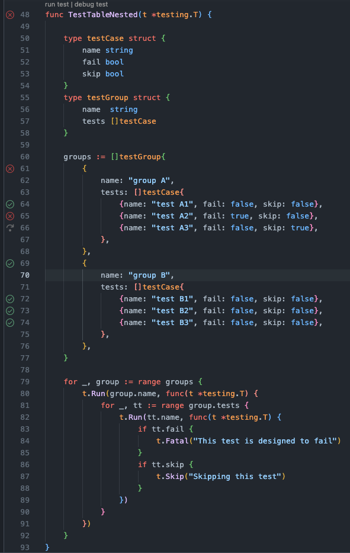
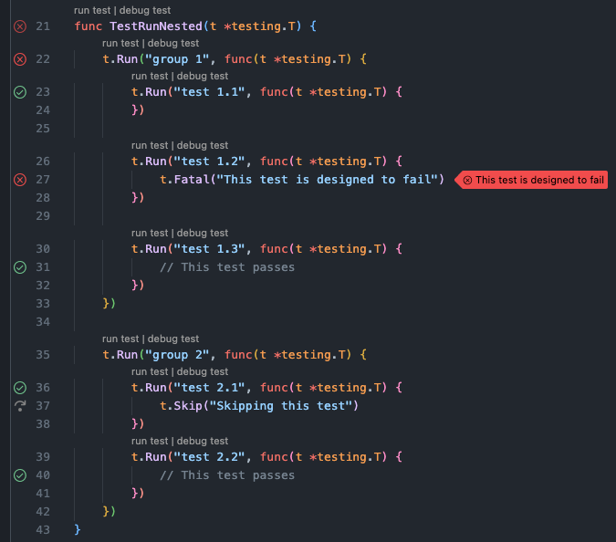

# Go Testing+

Run individual Go tests, sub-tests, and (static) table‑driven test cases directly from the VS Code Test Explorer.

## Overview

Go Testing+ augments the official Go extension's testing UI to give you fine‑grained control over Go test execution. It statically discovers:

- Test files (`*_test.go`)
- Top‑level test functions (`func TestXxx(t *testing.T)`)
- Nested `t.Run("case", ...)` sub‑tests (including those generated by simple table‑driven tests)
- Nested table tests (recursive `t.Run` chains)

Then it lets you run exactly the scope you select (single case, whole function, file, or all) via a dedicated run profile: **Go+**.

## Screenshots

### Table tests discovery



### Test cases (nested)



## Features

- Automatic discovery & refresh of Go test files (`**/*_test.go`) via file system watchers
- Run profile: **Go+** (standard run) and **Go+ (Debug)** (debug run)
- Run single sub‑test without executing siblings (narrow `go test -run '^Full/Test/Path$'` pattern)
- Support for nested table tests (static detection through symbol & reference analysis)
- Partial support for dynamic sub‑test names (i.e. concatenated names): they are discovered after the first run
- Parses `go test -json` output and streams relevant lines into the Test Explorer
- Failure message parsing with file & line hyperlink locations

## Requirements

- Go toolchain installed and `go` available on your PATH
- Go modules enabled (`GO111MODULE=on` implicitly set if not present)

## Commands & Run Profiles

The extension creates the following Test Run Profile:

- **Go+** – Standard run (non‑debug) for any selected scope.
- **Go+ (Debug)** – Debug run for any selected scope.

## Known Limitations

- Dynamic table test names built from variable concatenation and test cases with positional initialization (i.e. without field names) are only resolved after the first run.

```go
 tests := []struct {
		name string
		fail bool
		skip bool
	}{
	    {"test A", false, false},
        {"test " + "B", false, false},
        ...
```

- Indirect usages of the testing.T variable inside the main test function would not be statically discovered. This is because the extension relies on static analysis of references to the parameter of the test function. For example:

```go
 func TestXxx(t *testing.T) {
     tt := t
     tt.Run("case1", func(t *testing.T) { ... })
 }
```

- Benchmark (`BenchmarkXxx`) and example tests are not discovered.

## Roadmap

| Area       | Planned Enhancements                                 |
| ---------- | ---------------------------------------------------- |
| Benchmarks | Discover & run `Benchmark*` functions                |
| Coverage   | Optional `-cover` integration with inline decoration |

## Contributing

Contributions are welcome!

## Release Notes

### 0.3.0

- Resolve test with dynamic names after first run
- Improved test output processing 
- Fix refresh of tests on file changes
- Readme updated

### 0.2.2

- Updated roadmap with implemented features (debugging)

### 0.2.1

- Initial discovery of test files is now batched to avoid errors with large codebases

### 0.2.0

- Added support for debugging tests
- Fixed handling of test output parsing
- Fixed test file refresh

### 0.1.1

- Added extension icon
- Removed activation info message
- Fixed discovery for test cases with the same name

### 0.1.0

- Initial release
- Test discovery (files, functions, nested sub‑tests, simple table tests)
- Single test run via anchored `-run` regex
- JSON output parsing & failure location mapping
- File watcher for incremental updates

---

Happy testing! 🧪
